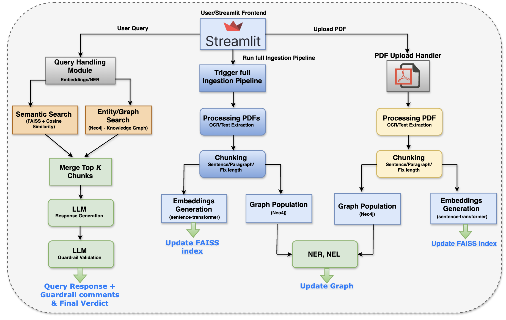

# HybridLLM_Knowledge_Agent
Hybrid Knowledge Retrieval System (Vector Search + Knowledge Graph)

## 📄 Project Report
You can view the full project report here: [Download Project Report PDF](./docs/Project_Report.pdf)

[

## Overview

This project implements a **hybrid knowledge retrieval and question-answering system** that combines **semantic vector search** with a **knowledge graph (KG)** to deliver accurate, context-aware, and verifiable responses from unstructured documents (PDFs).

The system is designed as an **assessment-grade, production-oriented prototype**, demonstrating how modern enterprise AI systems can move beyond pure vector similarity by incorporating **entity relationships, structured knowledge, and guardrail-based validation**.

The application supports:
- PDF ingestion and OCR
- Flexible text chunking
- Vector indexing using FAISS
- Knowledge graph construction using Neo4j
- Hybrid retrieval (Vector + KG)
- Guardrail-based response validation
- Interactive Streamlit-based UI

---

## Key Features

- **Hybrid Search Architecture**
  - Semantic vector retrieval (FAISS)
  - Entity-relationship traversal (Neo4j)
- **Multiple Chunking Strategies**
  - Sentence-based
  - Paragraph-based
  - Fixed-length chunks
- **Dynamic Knowledge Updates**
  - PDF upload
  - Full ingestion pipeline
- **Guardrail-Based Response Evaluation**
  - Context-grounded answer validation
- **Enterprise-Oriented Design**
  - Traceability
  - Scalability
  - Modular architecture

---

## Project Structure

```text
project_root/
│
├─ embeddings.py                 # FAISS embedding creation, saving/loading index, vector metadata
├─ graph.py                      # Neo4j interaction: create nodes, relationships, clear graph
├─ entities.py                   # NER/Entity extraction and enriching the graph
├─ chunking.py                   # Text chunking logic (sentence, paragraph, fixed)
├─ llm_query_and_guardrail.py    # LLM query + guardrail validation
├─ main.py                       # Orchestrator: ingestion, entity extraction, embeddings, query flow
├─ streamlit_app.py              # Streamlit UI (querying, PDF upload, ingestion)
│
├─ ocr_chunks/                   # OCR output for PDFs (text chunks)
│   ├─ pdf_a/
│   ├─ pdf_b/
│   └─ pdf_c/
│
├─ faiss_index.idx               # Persisted FAISS index
├─ faiss_metadata.json           # Metadata for indexed chunks
└─ requirements.txt
````

---

## Role of `main.py` – System Orchestration Layer

The `main.py` module acts as the **central orchestration layer** of the application. Rather than embedding business logic inside the UI or individual components, this file coordinates the full lifecycle of **knowledge ingestion, retrieval, and response generation** in a controlled and predictable manner.

From a system design perspective, `main.py` enforces **separation of concerns** by serving as the integration point between independent modules such as chunking, embeddings, entity extraction, knowledge graph construction, retrieval, and LLM interaction.

---

## High-Level Architecture

The system follows a **workflow-oriented architecture**, starting from user interaction and flowing through ingestion, retrieval, validation, and response generation.



### Core Components

* **Frontend:** Streamlit application for interaction
* **Embedding Layer:** FAISS-based vector indexing
* **Knowledge Layer:** Neo4j-based entity graph
* **Retrieval Layer:** Hybrid vector + KG search
* **Generation Layer:** LLM-based answer synthesis
* **Validation Layer:** Guardrail-based response verification

---

## Application Workflow

### 1. Knowledge Ingestion

Triggered via:

* **PDF Upload**
* **Run Full Ingestion Pipeline**

Steps:

1. PDF is processed and OCR text is extracted
2. Text is chunked using the selected strategy
3. Embeddings are generated and stored in FAISS
4. Named entities are extracted from chunks
5. Entities and relationships are stored in Neo4j

Both FAISS and the Knowledge Graph are updated incrementally.

---

### 2. Query Processing

When a user submits a question:

1. The query is embedded
2. **Vector Search**

   * FAISS retrieves top-K semantically similar chunks
3. **Knowledge Graph Search**

   * Entities are extracted from the query
   * Neo4j retrieves related nodes and relationships
4. **Hybrid Retrieval**

   * Vector and KG results are merged and re-ranked
5. Context is passed to the LLM for answer generation

---

### 3. Response Validation (Guardrail)

Before returning the answer to the user:

* A guardrail check validates:

  * Whether the answer is grounded in retrieved context
  * Whether unsupported claims exist
  * Overall response reliability

The system outputs:

* **Final Answer**
* **Validation Verdict** (Pass / Partial / Fail)

---

## Hybrid Search Logic (Vector + Knowledge Graph)

This system does **not rely solely on cosine similarity**.

### Vector Search (FAISS)

* Captures semantic similarity
* Handles paraphrased or loosely phrased queries
* Efficient at scale

### Knowledge Graph Search (Neo4j)

* Captures explicit relationships
* Preserves entity connections and context
* Enables structured reasoning paths

### Hybrid Retrieval

* Vector search ensures **semantic recall**
* KG traversal ensures **contextual precision**
* Combined results improve both **accuracy and explainability**

---

## Chunking Strategy

The system supports three chunking modes:

* **Sentence-based:**
  Best for precise, fact-based queries
* **Paragraph-based:**
  Preserves narrative and contextual continuity
* **Fixed-length:**
  Optimized for consistent embedding size and indexing performance

This flexibility allows tuning based on document type and query behavior.

---

## LLM Choice

* **Model:** `llama-4-scout-17b-16e-instruct`
* **Access:** GROQ API

This is an **instruction-following model**, not a dedicated reasoning model.
It relies on **retrieved context** rather than internal chain-of-thought reasoning, making it well-suited for **RAG-style enterprise systems**.

---

## Why Traditional NLP Metrics Are Not Used

Metrics such as **ROUGE, BLEU, or METEOR** are not applicable because:

* They measure surface-level text similarity
* They do not assess factual correctness
* They cannot detect hallucinations
* They ignore source grounding

Instead, **guardrail-based validation** is used to ensure enterprise-grade reliability.

---

## Running the Application

### 1. Install Dependencies

```bash
pip install -r requirements.txt
```

### 2. Start Neo4j

Ensure Neo4j is running and credentials are configured in `graph.py`.

### 3. Run the Application

```bash
streamlit run streamlit_app.py
```

---

## Design Considerations

* Modular and extensible architecture
* Incremental ingestion without reprocessing
* Clear separation of concerns
* Production-oriented structure
* Traceable and auditable responses

---

## Future Enhancements

* Confidence-weighted hybrid ranking
* Graph-aware re-ranking
* Multi-hop KG reasoning
* Document-level access controls
* Evaluation dashboards

---

## Author Note

This project was developed as a **technical assessment** to demonstrate practical experience in **AI systems design**, **hybrid retrieval architectures**, and **enterprise-ready RAG pipelines**, reflecting real-world constraints and best practices.

---


